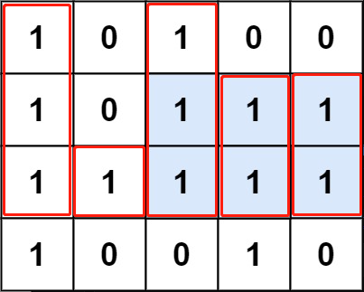

# LeetCode85：最大矩阵

## 题目

给定一个仅包含 0 和 1 、大小为 rows x cols 的二维二进制矩阵，找出只包含 1 的最大矩形，并返回其面积。

 

示例 1：


```
输入：matrix = [["1","0","1","0","0"],["1","0","1","1","1"],["1","1","1","1","1"],["1","0","0","1","0"]]
输出：6
解释：最大矩形如上图所示。
```


示例 2：

```
输入：matrix = []
输出：0
```

示例 3：

```
输入：matrix = [["0"]]
输出：0
```

示例 4：

```
输入：matrix = [["1"]]
输出：1
```

示例 5：

```
输入：matrix = [["0","0"]]
输出：0
```


提示：

```
rows == matrix.length
cols == matrix[0].length
1 <= row, cols <= 200
matrix[i][j] 为 '0' 或 '1'
```

## 解法一：前缀和+单调栈

这个题目可以先统计在前i行中第j列的最大高度`heightMap[i][j]`，如示例1所示，对于第3行的最大高度即为`[3, 1, 3, 2, 2]`。如下图所示，我们不难将其与"84.最大矩阵面积"的解法联系起来 - 利用单调栈求一个数组(柱体数组)中的最大面积，求得第3行的最大面积即为6(深色区域部分)。



所以，在求得每一行的"高度信息"后，我们只需要枚举行数，去调用对应的单调栈求矩形面积的算法即可。代码如下：

```c++
class Solution {
public:
    int ans = 0;
    
    // 利用单调栈求矩阵最大面积
    void findMaxRect(vector<int> heightMap) {
        int n = heightMap.size();
        stack<int> stk; // 递增栈
        
        int res = 0;
        for (int i = 0; i < n; i++) {
            while (!stk.empty() && heightMap[i] < heightMap[stk.top()]) {
                int x = stk.top();  stk.pop();
                int pre = stk.empty() ? -1 : stk.top();
                int cur = heightMap[x] * (i - pre - 1);
                res = max(res, cur);
            }
            stk.push(i);
        }
        
        while (!stk.empty()) {
            int x = stk.top();  stk.pop();
            int pre = stk.empty() ? -1 : stk.top();
            int cur = heightMap[x] * (n - pre - 1);
            res = max(res, cur);
        }
        
        ans = max(ans, res);    // 更新最终答案
    }
    
    int maximalRectangle(vector<vector<char>>& matrix) {
        int m = matrix.size();
        if (m == 0) return 0;
        int n = matrix[0].size();
        
        // heightMap[i][j]记录在[0,i]行中第j列的最大高度(连续1个数)
        vector<vector<int>> heightMap(m, vector<int>(n, 0));
        for (int i = 0; i < m; i++) {
            for (int j = 0; j < n; j++) {
                if (matrix[i][j] == '1') {
                    int h = i == 0 ? 0 : heightMap[i-1][j];
                    heightMap[i][j] = 1 + h;
                }
            }
        }
        
        // 对每一行使用“求最大矩阵面积”的解法
        for (int i = 0; i < m; i++) {
            findMaxRect(heightMap[i]);
        }
        
        return ans;
    }
};
```

时间复杂度：O(mn)

空间复杂度：O(mn)