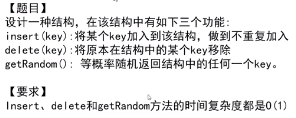

# 学会使用C++数据结构

c++本身为我们提供了很多好用的数据结构以及标准模板库（`STL`），在刷题的过程中如果能够很好地利用这些工具，将会事半功倍。

基本内容包括数组`vector`，字符串`string`，栈`stack`，队列`queue`的基本使用，以及基于这些数据结构的变换。

还有常用的**STL**，比如排序`sort`：通常需要对排序规则进行一些自定义，老是忘记特地记下来:

```c++
static bool compare(const atuo& a, const auot& b){
    return ;
}
```


####  1. 优先队列

用O(1)的时间复杂度查询最大值/最小值，O($logn$)的时间复杂度插入任意值/取出最值优先队列通常采用堆来实现，堆是一个完全二叉树：对于每个节点，都大于子节点的值。由于是完全二叉树，因此堆主要采用`vector`实现（父节点`i/2`,子节点`2i+1`和`2i+2`）。

但C++中早已实现好了优先队列，可以很方便的调用，定义如下所示，其他设置和`queue`一致。

```c++
priority_queue <int, vector<int>, greater<int>> q; // 小顶堆 - 升序队列
priority_queue <int, vector<int>, less<int>> q; // 大顶堆 - 降序队列
```

> 优先队列中采用若要采用自定义的比较函数 https://blog.csdn.net/AAMahone/article/details/82787184

```c++
// 比较pair类型
struct cmp{
	bool operator()(const pair<int,int>& a, const pair<int,int>& b) const{
		return a.second > b.second;	//小顶堆, 距离小的优先，与sort相反
	}
};
```

关于优先队列的使用有一个非常重要的技巧就是**延迟删除**：不用急着把无效【不满足当前要求】元素从队列中删除，而是设置一个判断条件，**当无效元素占据了堆顶时才进行删除**。参考218天际线问题和239滑动窗口问题。

#### 2. 双端队列

可以同时操作队首元素和队尾元素，如果队列中的元素满足单调性，那么也称之为**单调队列**。使用STL库中的`deque`.

```c++
deque<int> q;
q.push_back(); q.pop_back(); // 插入和删除队尾元素
q.push_front(); q.pop_front(); // 插入和删除队尾元素
```

#### 3. 集合与哈希表*

主要涉及到`set`和`map`的使用（进行有序存储），对存储没有顺序要求时建议使用`unodered_set`,`unodered_map`，有着更快的查询和插入速度O(1)。

哈希函数有四个特点：① 输入域无穷大，输出域有穷；② 相同的输入必定得到相同的输出；③ 不同的输入可能得到相同的输出(哈希碰撞)；④ 哈希域存在分散性(哈希值将均匀地分散在值域中，因此取余不会影响分散性)。

> 对于小范围内的数据，可以使用定长数组作为存储介质，效率更高。

```c++
// 初始化
map<int, int> myMap = { {1,2}, {2,3}, {4,5} };
// 遍历
for(auto it : myMap){
    cout << it.first << " " << it.second << "  ";
}
// 删除
myMap.erase(1);
```

**a. random pool** (题380)：核心操作就是**维护两个哈希表**，一个是`A-[key, idx]`，另一个是`B-[idx, key]`，以及一个变量`nsize`表示目前已存储元素的长度。插入操作就直接插入记录即可；查询时得到一个`[0,nsize)`的随机变量，去获取`B`中的值接口；删除时，删除对应元素，然后将最后的记录补到当前的空处(为了方便查询)。



**b. 布隆过滤器**：只有查询和插入操作，并且针对超大数据集，**允许一定程度的失误率**【不存在黑名单中但是查询存在(错杀率)】。其核心实现是构造一个`m`位的位图，采用`k`个哈希函数，当插入一个新值时，送入`k`个哈希函数分别得到结果【%m将值域映射到[0, m)内】，并将位图对应位置置为1；查询时使用相同的操作，查询对应位图是否全为1，如果全为1则返回`true`(存在)。

> 实际操作先确定m（越大越好）$m=-\frac{n\times\ln{p}}{(ln2)^2}$，再确定k（需要一个合适值）$k=ln2 \times \frac{m}{n}$，实际失误率$p=(1-e^{-\frac{m*k}{m}})^k$

**c. 和为k的子数组问题**：对于一个数组，我们要求**和为k的子数组**，有一种典型的方法就是使用"**前缀和 + 哈希表**"，在一次遍历过程中，用哈希表存储前缀和为t出现的次数，将问题转换为`preSum[j]-K`的数组在之前出现过几次。这一类题型还有许多变种，比如(题525-连续数组，题974-和可被k整除的子数组)。

#### 4. 多重集合与映射

操作基本与`set / map`一致，但其可以插入多个相同的元素，题332。

#### 5. 单调栈*

通过维持栈中的单调性（递增/递减）来更方便地解决问题[通常“**找到一维数组中左边第一个满足某个条件的元素+右边第一个满足某个条件的元素**”时应用单调栈]，比如找到"左边第一个比当前元素大的值 + 右边第一个比当前元素大的值"，我们就去维护一个递减栈(大→小 )。

```c++
// 核心代码段
satck<int> stk;
for(auto& i:nums){
    while(!stk.empty() && 某个条件){
        执行操作；
    }
    stk.push(i);
}
// 清算阶段 - 处理stk中未处理的数据
while (!stk.empty()){
    ... // 执行操作
}
```

> 单调系列的题目包括接雨水(42)、子数组的最小值之和(907)

#### 6. 大根堆 + 小根堆

最经典题型就是**求数据流的中位数**：用户输入数据流，需要随时能够得到当前数据流的中位数[`O(1)`复杂度]。

**解法**：使用一个**大根堆`priQueL`记录左半区间**，**小根堆`priQueR`记录右半区间**，使得中位数出现在栈顶元素中。

对新输入的数字`t`：① 如果`t ≤ priQueL.top()`，直接入`priQueL`，否则加入`priQueR`；② 判断`priQueL`与`priQueR`之间的`size`差异，始终维持`priQueL.size() - priQueR.size() >= 1`的状态。

查询的时候，判断当前是否是偶数长度`priQueL.size() == Right.size() `，返回`(priQueL.top() + priQueR.top()) / 2`，否则返回`priQueL.top()`。

```c++
void addNum(int num) {
    if (priQueL.empty() || num <= priQueL.top()) {
        priQueL.push(num);
        // 使其满足约束
        if (priQueL.size() > priQueR.size()+1) {
            priQueR.push(priQueL.top());
            priQueL.pop();
        }
    }
    else {
        priQueR.push(num);
        if (priQueR.size() > priQueL.size()) {
            priQueL.push(priQueR.top());
            priQueR.pop();
        }
    }
}
    
double findMedian() {
    if (priQueL.size() > priQueR.size()) {
        return priQueL.top();
    }
    else{
        return double(priQueL.top() + priQueR.top()) / 2;
    }
}
```

**扩展**：① 如果数据流中所有整数都在 0 到 100 范围内，你将如何优化你的算法？

> 构造**计数排序**并维护数组内元素个数，查询时先计算中位数的索引，通过一次遍历得到结果

② 如果数据流中 99% 的整数都在 0 到 100 范围内，你将如何优化你的算法？

> 还是构造**计数排序**，同时维护两个有序表(<0 和 >100)，查询与上述类似，如果落在两个有序表中，暴力查询即可

