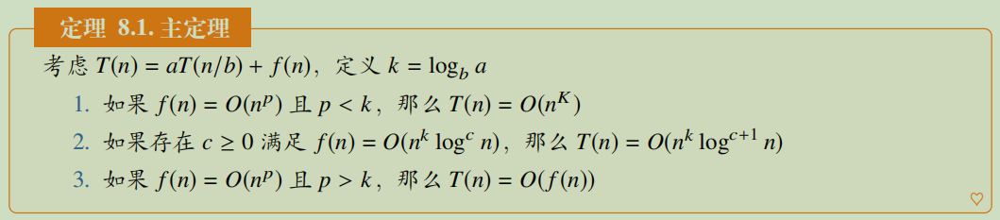

# 分治

分治问题由“分”（divide）和“治”（conquer）两部分组成，**分**：通过把原问题分为子问题；**治**：将子问题进行处理合并，从而实现对原问题的求解。

其中涉及到分治算法的复杂度求解可以使用主成分分析：

其中最经典的分治算法就是**归并排序**，将数组分成左右两部分，对每部分分别进行排序后，然后再组合成一个有序数组。同时每个部分又可以往下继续划分，直到子数组部分的长度为1。(题912)