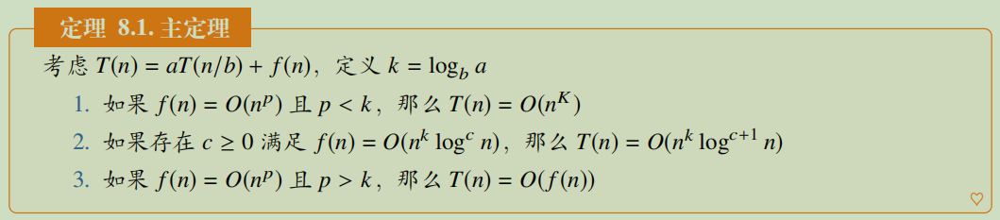

# 分治 / 递归

分治问题由“分”（divide）和“治”（conquer）两部分组成，**分**：通过把原问题分为子问题；**治**：将子问题进行处理合并，从而实现对原问题的求解，通常要用递归算法实现。

其中涉及到分治/算法的复杂度求解可以使用主成分分析：



其中最经典的分治算法就是**归并排序**，将数组分成左右两部分，对每部分分别进行排序后，然后再组合成一个有序数组。同时每个部分又可以往下继续划分，直到子数组部分的长度为1。(题912)

#### 1. 汉诺塔问题

很经典的一个递归问题，三根柱子和N个不同大小的穿孔圆盘，考虑如何移动圆盘的[问题](https://leetcode.cn/problems/hanota-lcci/)，代码如下：

```c++
template <typename T>
void f(T& x, T& y, T& z, int n) {  // 柱x通过柱y将n个圆盘移动到柱z上
    if (n == 1) {   // 只剩一个的时候直接移动
        z.push_back(x.back());
        x.pop_back();
        return ;
    }

    f(x, z, y, n-1);    // 先将x的n-1个圆盘移动到y上
    f(x, y, z, 1);      // 再将x的1个圆盘移动到z上
    f(y, x, z, n-1);    // 最后将y上的n-1个圆盘移动到z上
}
  
```

