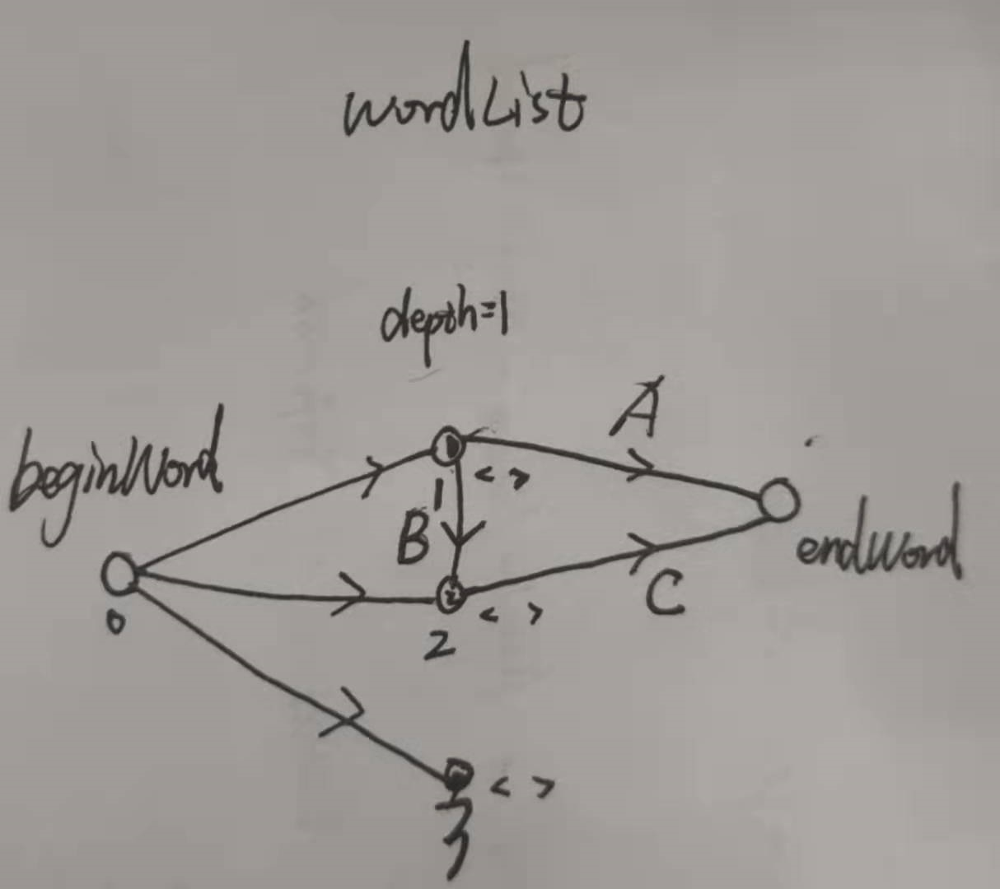

# Leetcode126：单词接龙II

## 题目

按字典 `wordList` 完成从单词 `beginWord` 到单词 `endWord` 转化，一个表示此过程的 **转换序列** 是形式上像 `beginWord -> s1 -> s2 -> ... -> sk` 这样的单词序列，并满足：

- 每对相邻的单词之间仅有单个字母不同。
- 转换过程中的每个单词 `si`（`1 <= i <= k`）必须是字典 `wordList` 中的单词。注意，`beginWord` 不必是字典 `wordList` 中的单词。
- `sk == endWord`

给你两个单词 `beginWord` 和 `endWord` ，以及一个字典 `wordList` 。请你找出并返回所有从 `beginWord` 到 `endWord` 的 **最短转换序列** ，如果不存在这样的转换序列，返回一个空列表。每个序列都应该以单词列表 `[beginWord, s1, s2, ..., sk]` 的形式返回。

 

**示例 1：**

```
输入：beginWord = "hit", endWord = "cog", wordList = ["hot","dot","dog","lot","log","cog"]
输出：[["hit","hot","dot","dog","cog"],["hit","hot","lot","log","cog"]]
解释：存在 2 种最短的转换序列：
"hit" -> "hot" -> "dot" -> "dog" -> "cog"
"hit" -> "hot" -> "lot" -> "log" -> "cog"
```

**示例 2：**

```
输入：beginWord = "hit", endWord = "cog", wordList = ["hot","dot","dog","lot","log"]
输出：[]
解释：endWord "cog" 不在字典 wordList 中，所以不存在符合要求的转换序列。
```

 

**提示：**

- `1 <= beginWord.length <= 7`
- `endWord.length == beginWord.length`
- `1 <= wordList.length <= 5000`
- `wordList[i].length == beginWord.length`
- `beginWord`、`endWord` 和 `wordList[i]` 由小写英文字母组成
- `beginWord != endWord`
- `wordList` 中的所有单词 **互不相同**

## 解法一：BFS建图+DFS回溯

这个题目乍一看可以采用BFS来搜索，从`beginWord`开始搜索，以此每个位置上的每个字符(`从a到z`)，然后去`wordList`中找是否存在对应的元素，若存在则压入队，依次进行层次搜索，直到找到通往`endWord`的最短路径集合。

思路是对的，但在实现上有一些小技巧，我们不存储每一条完整路径，因为这样实现复杂并且消耗不必要的内存，代码中用一个`vector`存储结点的源（由哪些结点变化而来）。其次，额外用一个`vector`存储每个节点的深度，这方便后续比较当前路径是否为最短。先对照看代码，后面会列出详细分析：

```c++
class Solution {
public:
    // DFS - backtracking DFS回溯用于得到所有路径
    void dfs(vector<vector<string>>& ans, string& node, unordered_map<string, vector<string>> origin, 
            vector<string>& path){
        if(origin[node].empty()){
            reverse(path.begin(), path.end()); // 由于当前的路径相反，记得进行反转
            ans.push_back(path);
            reverse(path.begin(), path.end()); // 恢复
        }
        for(auto& freNode:origin[node]){
            path.push_back(freNode);
            dfs(ans, freNode, origin, path);
            path.pop_back();
        }
    }

    vector<vector<string>> findLadders(string beginWord, string endWord, vector<string>& wordList) {
        vector<vector<string>> ans;	
        // save wordList in set
        unordered_set<string> dict = {wordList.begin(), wordList.end()};	
        // check if endword exists
        if(dict.find(endWord)==dict.end()){
            return ans;
        }
        // step 1: bulid graph 建图
        unordered_map<string, int> depths = {{beginWord, 0}};	// 存储各结点深度
        unordered_map<string, vector<string>> origin = {{beginWord, {}}};	// 存储源节点
        int depth = 0;
        // 从beginWord出发
        queue<string> q;
        q.push(beginWord);
        // BFS 
        bool foundFlag = false;
        while(!q.empty()){
            depth++;
            int k = q.size();
            // Level Traversal 层次遍历
            while(k--){
                string curWord = q.front();
                string nextWord = curWord;
                q.pop();
                int len = curWord.size();
                // earse curWord
                dict.erase(curWord); // 避免后面重复压入相同节点
                // each character 依次改变每个位置上的字符
                for(int i=0; i<len; i++){
                    char beforeChar = nextWord[i];
                    for(char x='a'; x<='z'; x++){
                        nextWord[i] = x;
                        // 检查是否可以变化到wordList中的节点
                        if(dict.find(nextWord)!=dict.end()){
                            // not traversed 如果节点没有被遍历过
                            if(depths.find(nextWord)==depths.end()){
                                depths[nextWord] = depth;
                                origin[nextWord].push_back(curWord);
                                q.push(nextWord);
                            }
                            // be traversed 如果节点被遍历过则判断深度
                            else if(depths[nextWord]>=depth){
                                origin[nextWord].push_back(curWord);
                            }
                        }
                        if(nextWord==endWord){ // 已经遍历到endWord，可以不用进入下一层遍历
                            foundFlag = true;
                        }
                    }
                    nextWord[i] = beforeChar; // 记得恢复状态
                }
            }
            if(foundFlag)   break;
        }
        // DFS 恢复结果
        if(foundFlag){
            vector<string> path = {endWord};
            dfs(ans, endWord, origin, path);
        }
        return ans;
    }
};
```

时间复杂度：O(26·L·N)，一个很宽泛的上界，L为单词长度，N为单词个数

空间复杂度：O(N·N)，也是一个很宽泛的上界

**分析**：具体见下图（画的不好..)，从`beginWord`(0)出发，然后删除`wordList`中的0节点(如果存在)，通过单词变换能遍历到`wordList`中的1,2,3节点，更新他们`origin`，并且深度为1。然后从下一层开始，此时队列中存在1,2,3三个节点，进行层次遍历，首先A通道满足`endword`节点未被遍历的情况，所以更新`endword`的相关状态；B通道处于同一深度下的已遍历节点连接，不满足条件；C通道满足`endword`节点被遍历，但深度不一致的情况。



最后origin[endword]={1,2}，depths[endword]=2.再利用DFS恢复路径。