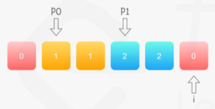

# LeetCode75：颜色分类

## 题目

给定一个包含红色、白色和蓝色，一共 `n` 个元素的数组，**[原地](https://baike.baidu.com/item/原地算法)**对它们进行排序，使得相同颜色的元素相邻，并按照红色、白色、蓝色顺序排列。

此题中，我们使用整数 `0`、 `1` 和 `2` 分别表示红色、白色和蓝色。


**示例 1：**

```
输入：nums = [2,0,2,1,1,0]
输出：[0,0,1,1,2,2]
```

**示例 2：**

```
输入：nums = [2,0,1]
输出：[0,1,2]
```

**示例 3：**

```
输入：nums = [0]
输出：[0]
```

**示例 4：**

```
输入：nums = [1]
输出：[1]
```

 

**提示：**

- `n == nums.length`
- `1 <= n <= 300`
- `nums[i]` 为 `0`、`1` 或 `2`

 

**进阶：**

- 你可以不使用代码库中的排序函数来解决这道题吗？
- 你能想出一个仅使用常数空间的一趟扫描算法吗？

## 解法一：计数排序

首先本题如果当做普通排序的题目来做，直接一个`sort`解决战斗，但显然不符合题意。

解法一利用计数排序的思想，两次遍历，第一次遍历数组中0,1,2各元素出现的次数，第二次输出结果即可。代码如下：

```c++
class Solution {
public:
    void sortColors(vector<int>& nums) {
        // 计数
        vector<int> rwl(3, 0);
        for(int& i:nums){
            rwl[i]++;
        }
        // 输出结果
        int t = 0;
        for(int i=0; i<3; i++){
            for(int j=0; j<rwl[i]; j++){
                nums[t++] = i;
            }
        }
    }
};
```

时间复杂度：O(n)

空间复杂度：O(1)

## 解法二：三指针（一次遍历）

根据进阶要求，只能执行一趟扫描来进行排序。那么这里就要用到多指针的技巧，设置`p0,p1`两个指针，指向首部，此外用指针`i`从头遍历数组元素。核心思想就是将数组中的0、1依次移到靠前位置。

当`i`遍历到1时，交换`nums[i]`与`nums[p1]`，然后`p1++`。当`i`遍历到0时，交换`nums[i]`与`nums[p0]`，此外为了防止将`p0`中的`1`移到后面，需要判断`p0、p1`之间的关系：如果`p0<p1`，说明当前交换会将`1`交换出去，因此还要进行一次`nums[i]`与`nums[p1]`的交换，然后进行`p0++,p1++`。这种情形下的示意图：



> 图来自https://leetcode-cn.com/problems/sort-colors/solution/yan-se-fen-lei-by-leetcode-solution/

代码如下：

```c++
class Solution {
public:
    void sortColors(vector<int>& nums) {
        // 初试化指针p0,p1
        int n = nums.size(), p0 = 0, p1 = 0;
        for(int i=0; i<n; i++){
            if(nums[i]==0){
                swap(nums[p0], nums[i]);
                if(p0<p1){	// 二次交换
                    swap(nums[p1], nums[i]);
                }
                p0++;   p1++;
            }
            else if(nums[i]==1){ // 
                swap(nums[p1], nums[i]);
                p1++;
            }
        }
    }
};
```

时间复杂度：O(n)

空间复杂度：O(1)

> 利用同样的思路也可以构建p1,p2或者p0,p2指针的解法