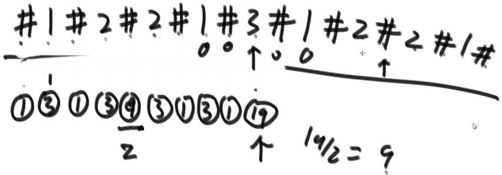
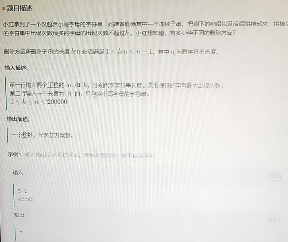
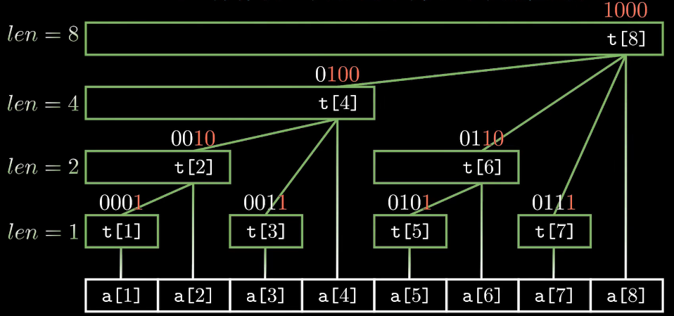

# 数组和字符串

[toc]

> 本节不止包含字符串的内容，还包含数组，基本上为简单/中等难度题。

## 0. 字符串输入以及常用处理

```c++
cin>>s;	// 直接输入 以空格为止
cin.ignore(); // 忽略某个输入，通常是回车符
getline(cin, s);	// 输入字符串s，包括空格，回车符结束
```

```c++
to_string(x);	// 其他类型转string，int longlong double...都可以
stoi(s); stol(s); stof(s)	// string转int,long long,float

char* t = (char*)s.c_str();	// String转char*
str = t;	// char* 转string
```

```c++
// 字符串分割
vector<string> splitStr(string s, string pattern) {
    if (s.empty())  return {};

    s += pattern;
    vector<string> ans;
    int pos = s.find(pattern);
    while (pos != s.npos) {
        // 提取信息
        string temp = s.substr(0, pos);
        ans.push_back(temp);
        // 去掉已分割的字符串，继续分割
        s = s.substr(pos+1, s.size());
        pos = s.find(pattern);
    }

    return ans;
}
```

## 1. 模拟

解决字符串类问题的主要方法之一就是**模拟**，将人解决问题的思路用编程实现即可。比如66,48,36题等等，这类问题通常比较简单，没有固定的代码模板（重要是找规律，如题400）。

当然也有不少题目会提出额外的要求，比如限制时间复杂度和空间复杂度，这就需要针对问题的特点提出解法。比如"剑指 03:数组中重复的数字"，搜索二维矩阵[题目74,240]，煎饼排序[969]、下一个排列[31]等。通常这类题目最好**从某个特例出发**，比如数组的前部，尾部，二维数组的四个顶点等等。

还有不少题目也要使用**双指针**来减少时间复杂度(11,15,16)，或者**先进行排序**，才容易看出规律，比如406题[根据身高重建队列++]。

还有一类题型是需要按照特殊要求进行数组遍历的，这种做法通常也是采用模拟的策略，但某些题目也需要观察得出规律。比如1424题对角线遍历，当提供的数组不是一个矩阵时，直接模拟就会时间复杂度爆炸，而每个元素的坐标就已经决定了它遍历的时机，(x+y)出现在同一次遍历中。

## 2. 字符串匹配*

一个常见的题型就是字符串匹配（在s串中查找t的起始位置），最优解法是KMP算法【O(N)时间复杂度】，可以见我这篇博客[暴搜 / KMP 详解](https://blog.csdn.net/qq_36560894/article/details/105210736)和[左神视频讲解](https://www.bilibili.com/video/BV13g41157hK?p=13&spm_id_from=pageDriver)。其核心思想是为串t构造一个`next`数组，`next[i]`存储了`t[0:i]`前缀==后缀的最长子串长度，然后在遍历时利用`next`数组跳过s中一些不可能匹配的位置(利用反证法证明)。

代码模板如下：

```c++
// 对t构造next数组 (next[i]表示t[0:i]中"前缀==后缀"的最长值)
void get_next(vector<int> & next, string t){
    next.push_back(-1);
    for (int i = 1; j < t.szie(); j++){
        int k = next[i-1];	// 需要与t[i-1]对比的字符索引
        while (k != -1 && t[i-1] != t[k]) {		// 不相等往前跳
            k = next[k];
        }
        next.push_back(k+1);	// 如果找到k+1, 否则为0
    }
}
// KMP匹配
int find_str(string s, string t){
    vector<int> next;
    get_next(next, t);
    int lens = s.zie(), lent = t.size(), i = 0, j = 0;
    while (i < lens && j < lent) {	// 保证不越界
        if (s[i] == s[j]) {	// 如果s[i] == t[j]相等，i,j一起向后移动
            i++; j++;
        }
        else if (next[j] == -1) {	// 如果s[i] != t[0], i向后移动
            i++;
        }
        else {	// 在t中找一个可匹配的位置
            j = next[j];
        }
    }
    return j == lent ? (i - j) : -1;	// 判断是否匹配
}
```

## 3. 回文字符串

回文串系列是字符串类型一个经典的问题【正序字符串==逆序字符串】。有关于涉及到回文子串的判断，主要会用到中心扩展（从某个中心到两边扩展判断是否为回文串），如例题647，其核心代码如下：

```c++
for(int i=0; i<n; i++){
    // 奇数回文串
    left = right = i;
    while(left>=0 && right<n && s[left]==s[right]){
        ans++;
        left--; right++;
    }
    // 偶数回文串
    left = i; right = i+1;
    while(left>=0 && right<n && s[left]==s[right]){
        ans++;
        left--; right++;
    }
}
```

> 还有一种暴力解法就是在每两个数字之间填充字符，然后左右扩展即可【最后将结果除以2即可】



### manacher算法*

> manacher算法不仅能以O(N)的复杂度求解回文字符串问题，由其求得的回文半径数组还能求解一系列回文问题

**相关概念**：① **回文直径**就是某个回文字符串的长度；② **回文半径**就是一半的回文字符串【(直径+1)/2】；③ **回文半径数组**：从左往右遍历字符串的字符，记录对应的回文半径放一个数组中；④ 之前的回文字符串中所到达的**最右回文右边界R**(int)；④ 记录当前**最右回文字符串的中心位置C**(int)。

**核心思想**：从左到右遍历字符串，在`pArr[i]`中记录字符`str[i]`对应的最长回文串半径，并更新R、C，在遍历到一个新字符时，可以根据已统计的信息来避免一些重复判断。其具体流程如下：

* 对原始字符串进行处理 → 每两个字符间插入一个特殊符号，例如`#`；
* `i`不在`[L, R]`区间内，如果不在区间内，就直接暴力扩展求解，同时更新R、C；
* `i`在`[L, R]`区间内，找到`i`关于`C`对称的位置`i'=2*C-1`对应的最大回文字符串区间是否在`[L, R]`区间内，有三种情况：① 严格落于`(L, R)`区间内，那么`pArr[i]=pArr[i']`；② 长度已经超过了`[L, R]`区间，那么`pArr[i]=R-i+1`；③ 正好位于`[L, R]`区间上，那么可以继续尝试往外扩，同时更新R、C。

在具体代码实现时，也是依据这个原则，但是为了实现简洁，采用了一些优化措施，详见代码注释：

```c++
// 处理字符串 比如"aca" 变为 "#a#c#a#"
string convertStr(string s) {
    string str = "#";
    for (char c:s) {
        str += c;
        str += '#';
    }
    return str;
}
// 返回最长回文串的长度
int longestPalindrome(string s) {
    string str = convertStr(s);
    int n = str.size();
    vector<int> pArr(n);

    // 最右最长回文串的右边界和中心点
    int R = -1, C = -1;
    for (int i = 0; i < n; i++) {
        pArr[i] = R >= i ? min(pArr[2*C-i], R-i+1) : 1;    // 避免重复扩展(考虑了上述的所有情况)
        while (i+pArr[i] < n && i-pArr[i] >= 0) {   // 向左右两边扩展
            if (str[i+pArr[i]] == str[i-pArr[i]]) {
                pArr[i]++;
            }
            else    break;
        }
        if (i+pArr[i]-1 > R) {  // 更新R和C
            R = i+pArr[i]-1;
            C = i;
        }
    }
    
    return *max_element(pArr.begin(), pArr.end());
}
```

## 4. 数学运算*

一类题型是模拟计算器的`+ - * /`以及`()`运算，需要利用两个栈，一个存储操作符，一个存储计算值，并事先设定好优先级。包含很多细节，详见帖子：https://leetcode-cn.com/problems/basic-calculator/solution/shuang-zhan-jie-jue-tong-yong-biao-da-sh-olym/

涉及题型：227,224

核心策略：
* 维护两个栈(一个存放数字vals, 一个存放操作符opts),并先压入一个0; 
* 先处理多余字符(比如空格),设置优先级[有+-*/的情况];
* 遇到(直接入栈, 遇到数字需要处理得到连续的数值后入栈;
* 遇到+,-需要判断是否存在(-1的情况,如存在需要额外压入0,并且根据优先级，处理掉opts中同级与低级的算式[避免出现存储了1-2*3+3的情况];
* 遇到)需要处理掉opts中的算式，直到遇见了(;
* 最后处理到opts中剩余的算式,vals.top()即为最终结果.

另一类题型是用字符串模拟大数的`+`,`-`以及`*`法操作，对于加法和减法可以直接使用字符串模拟即可，从低位向高位逐位计算，并用一个变量`flag`记录借位和进位。
> 减法时需要注意先判断x,y两个数哪个大，用`大数-小数`，根据情况在结果前加入`-`号即可。

比较复杂一点的是字符串的乘法，这仍然可以拆分成`+`法来做，用`a`去乘以`b`上的每一位(注意尾随0的个数)，然后进行相加，但这类做法时间复杂度较高，为O(mn+$n^2$)。而一种比较简单的做法是将每一位都换成int存在`vector<int>`数组中，进行每一位的乘法+加法操作，最后再对数组进行一次进位操作即可。
> 有一个隐藏的小知识点: m位的数字a和n位的数字b，它们的乘积最多有`m+n`位，最少有`m+n-1`位。

涉及题目：43.字符串相乘，

## 5. 滑动窗口

滑动窗口的主要思想就是利用双指针构造一个`[start, end]`的窗口，通过统计窗口内信息来解决问题，最简单经典的例题比如1984，76(稍难)，438.

这类题一定要考虑好边界条件，比如习惯用`[L,R]`左闭右闭，就要在计算结果时R代表的含义。核心算法模板如下：

```c++
int slideWindow(vector<int> nums){
    int l = 0, r = 0, n = nums.size();
    while(r < n){
       if(nums[r] 满足某个条件)  更新状态;
       while(状态不满足){
            if(nums[l] 满足某个条件)  更新状态;
            l++;
       }
       ans = max(ans, 当前状态);	// 这是更新结果的操作，不一定要在这里
       r++;
    }
}
```

下面是网易算法岗实习的一道真题：*



```c++
vector<int> charCnt(26, 0); // 记录每个字母出现的个数

// 判断当前数组是否满足条件，如果满足返回true，反之false
bool isFine(int k){
    for(int i=0; i<26; i++){
        if(charCnt[i] > k)  return false;
    }
    return true;
}

int main(){
    int n, k; cin >> n >> k;
    string s;   cin >> s;

    // 统计各字符出现次数
    for(auto c:s)   charCnt[c-'a']++;

    // 滑动窗口
    int l = 0, r = 0, ans = 0;
    while(r < n){
        charCnt[s[r]-'a']--;
        while(isFine(k)){
            ans += n - r;
            charCnt[s[l]-'a']++;
            l++;
        }
        r++;
    }
    cout << ans - 1 << endl;
    return 0;
}
```


## 6. 前缀和*

前缀和的核心操作就是记录**从起始节点到当前节点的和值**，然后利用该数组辅助运算。最简单的题目就是303,304。其中304题使用的二维数组，因此也称为**积分矩阵/积分图**【这对于子矩阵问题至关重要】，**如果需要对前缀和或积分图的值做寻址，则要存在哈希表里**；如果要对每个位置记录前缀和或积分图的值，则可以储存到一维或二维数组里，**也常常伴随着动态规划**。

对于前缀和问题，如果需要对其中某个节点做修改再查询，就会非常麻烦。因此出现了一类特殊的数据结构可以很方便地处理这类问题：**树状数组**。

暴力搜索：单点修改O(1)，区间查询O(n)；树状数组：单点修改O($logn$)，区间查询O($logn$)。



对于一个序列，建立如上的森林节点结构其中（深度为$logn+1$）：

* t[x]保存以x为根的子树叶节点值的和；
* t[x]节点覆盖的长度为`lowbit(x)`；
* t[x]节点的父节点为t[x+`lowbit(x)`]；

这里给出代码模板，具体请看下方的视频资料：

```c++
void add(int x, int k){	// 单点修改 对a[x]+k
    while(x<=n){
        t[x] += k;
        x += x&(-x);
    }
}
int ask(int x){	// 查询前缀和
    int ans = 0;
    while(x){
        ans += t[x];
        x -= (x&x);
    }
    return ans;
}
/* 单点修改，区间查询 */
//add(x, k); ask(r) - ask(l-1); 返回[l,r]内的和

/* 区间修改，单点查询 */  t数组维护的是差分【增量】
//add(l, d);add(r+1, -d);  ans = a[x]+ask(x);
```

注意：使用树状数组后，每次的查询和修改都是针对`t数组`

参考视频资料：

[〔manim | 算法 | 数据结构〕 完全理解并深入应用树状数组 | 支持多种动态维护区间操作_哔哩哔哩_bilibili](https://www.bilibili.com/video/BV1pE41197Qj?from=search&seid=15618768793709952804&spm_id_from=333.337.0.0)

[【算法讲堂】【电子科技大学】【ACM】树状数组与ST表_哔哩哔哩_bilibili](https://www.bilibili.com/video/BV1LW411e7jo?from=search&seid=1388310269085443079&spm_id_from=333.337.0.0)


## 7. 合并区间

一类“给定若干区间的集合，合并重叠的区间，或者找到重叠的区间”的题型（56题）。

首先对所有区间**按照左边界排序**，然后判断**当前的左边界是否大于上一个的右边界**，如果大于说明两个区间没有重叠，否则融入这个区间，并且更新上一个区间的右边界。核心代码如下：

```c++
sort(intervals.begin(), intervals.end(), cmp);
for(auto& interval:intervals){
    // 如果为空 or 当前左端点大于前一个的右端点 直接加入
    if(ans.empty() || interval[0] > ans.back()[1]) ans.push_back({interval[0], interval[1]});
    // 存在重叠，更新右边界
    else{
        ans.back()[1] = max(interval[1], ans.back()[1]);
    }
}
```


## 8. 差分数组*

给定一个数组，要对某一个区间进行**加/减**操作，通常需要O(n)的时间复杂度，如果需要多次区间操作，时间复杂度就会变得非常高O(n·T)。而差分数组就是根据原数组求得一个**差分数组**，每次区间操作只需要**修改两个端点**，然后利用**前缀和**即可得到操作后的结果，时间复杂度变为O(t+n)。

具体操作如下：

① 计算差分数组`d[n]`：`d[i] = a[i] - a[i-1]`；

② 区间操作：对`[L, R]`加`cnt`，`d[L] += cnt; d[R+1] -= cnt;`;

③ 利用前缀和还原结果：`a[i] = a[i-1] + d[i];`.

```c++
int nums[105], diff[105];
// 前缀和逆操作 - 求差分数组
for(int i=1; i<n; i++)	diff[i] = nums[i] - nums[i-1];
// 区间修改
for(auto [l, r, cnt]:opts){
    diff[l] += cnt;
    diff[r+1] -= cnt;
}
// 前缀和 - 还原处理后数组
for(int i=1; i<n; i++)	nums[i] = diff[i] + nums[i-1];
```