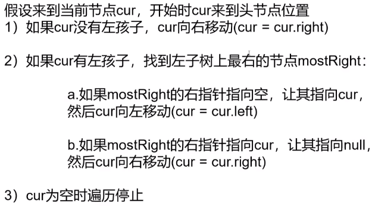

# 树

以下为LeetCode默认的树结构，每个节点存有一个值，和两个指向子节点的指针：

```c++
struct TreeNode {
    int val;
    TreeNode *left;
    TreeNode *right
    TreeNode(int x) : val(x), left(nullptr), right(nullptr) {}
};
```

与链表的区别就是多了一个指针。

#### 1. **树的基本操作与递归套路**

包括递归遍历(104)，平衡二叉树的判断(110)，二叉树的直径(543)，对称二叉树的判断(101)。稍难一些的题目有437，1110。以最经典的求二叉树直径为例（基于二叉树的最大深度的实现）：

```c++
	int ans = 0;
    int findDepth(TreeNode* root){
        if (root == nullptr)    return 0;
        // 求左右子树深度
        int left = findDepth(root->left);
        int right = findDepth(root->right);
        // 更新直径 （依次判断以每个节点作为中继点的路径长度[左子树最大深度+右子树最大深度]）
        ans = max(right+left, ans);
		// 返回最大深度
        return max(left, right) + 1;
    }
```

> 递归三要素：① 终止条件  ②  单层逻辑 ③  函数参数

**二叉树的递归套路：** ① 先思考判断条件是否成立需要哪些可能性（左子树满足何条件？右子树满足何条件？）② 再思考左右子树需要反馈什么信息（深度？节点个数？）③ 根据①和②完成代码。例如判断一棵树是否为平衡二叉树(110题)【**树形DP**】

```c++
// 定义返回值
class returnType{
	... // 定义需要返回的信息
    returnType (...) {...}	// 构造函数
};
```

#### 2. **层次遍历**

采用BFS进行层次遍历(**利用队列存储节点**：处理每个节点的过程中，把左右孩子入队列)，通常需要用一个**变量来记录当前层的节点个数**(队列中的元素个数)。

```c++
// queue<TreeNode*> que;
while (!que.empty()) {
	int k = que.size();
	while (k--) {
		TreeNode * node = que.front();	que.pop();
		// 相关操作
		if (node->left)	que.push(node->left);
    	 if (node->right)	que.push(node->right);
	}
}
```

此外，在一些特殊场景中，通常也需要记录每个节点的深度和索引号等信息，此时可以额外构造一个struct来辅助算法。比如在662题(二叉树的最大深度)中，就构造了一个记录深度和索引号信息的结构体：

```c++
struct newNode{
    TreeNode* p;    // 树节点
    int depth;  // 深度
    unsigned long long idx;    // 索引号
    newNode(TreeNode* p, int d, unsigned long long i): p(p), depth(d), idx(i) {}
};
// 在程序中的使用
newNode x = newNode(node, depth, idx);
```

#### 3.**树的前中后序遍历**

在递归的写法中，前中后序的写法都非常简单，以前序遍历为例：

```c++
void preOrder(TreeNode* root){
    if(root){
        ans.push_back(root->val);  // 前序
        preOrder(root->left);
        preOrder(root->right);
    }
}
```

但是在面试时可能会考察**非递归写法**，其实前/中/后序的递归和非递归实现，即用迭代实现。两种方式是等价的，区别在于**递归隐式地维护了一个栈，而在迭代的时候需要显式地将这个栈模拟出来**，其他都相同，具体实现可以看下面的代码（参考https://leetcode-cn.com/problems/binary-tree-inorder-traversal/solution/che-di-chi-tou-er-cha-shu-de-qian-zhong-hou-xu-d-2/）：

>  https://mp.weixin.qq.com/s/oZbOBHMDbm7OuGMFBhmihw

① 前序遍历：维护一个栈，**先处理当前节点**，**再将右孩子入栈，最后将左孩子入栈**

```c++
void preOrder(TreeNode* root) {
    if (root == nullptr)    return ;
    stack<TreeNode*> stk;
    stk.push(root);

    while(!stk.empty()){
        TreeNode * node = stk.top();
        stk.pop();
        cout << node->val << " ";
        // 先右再左
        if (node->right) stk.push(node->right);
        if (node->left) stk.push(node->left);
    }
}
```

② 中序遍历*：构造一个栈，对于每颗子树，**先将所有左边界进栈**，然后**处理弹出节点**，并且**对弹出节点的右子树重复**。

```c++
void inOrder(TreeNode* root) {
    if (root == nullptr)    return ;

    TreeNode* p = root;
    stack<TreeNode*> stk;
    while (!stk.empty() || p != nullptr) {
        // 子树所有左边界入栈
        while (p) {
            stk.push(p);
            p = p->left;
        }
        // 处理栈顶元素
        p = stk.top();
        stk.pop();
        cout << p->val << " ";
        // 重复处理右子树
        p = p->right;
    }
}
```

③ 后序遍历：之前的前序遍历得到的是"中-左-右"的结果，可以修改代码获得"中-右-左"的遍历结果，reverse一下即可。

除了栈`stk`之外，需要一个额外的存储数组`ans`，每次**先处理栈顶元素（存入`ans`）**，**先将左孩子入栈，然后右孩子入栈**，最后将`ans`反向一遍即可。

```c++
void postOrder(TreeNode* root) {
    if (root == nullptr)    return ;

    vector<int> ans;
    stack<TreeNode*> stk;
    stk.push(root);

    while (!stk.empty()) {
        TreeNode * node = stk.top();
        stk.pop();
        ans.push_back(node->val);
        // 先左后右
        if (node->left) stk.push(node->left);
        if (node->right)    stk.push(node->right);
    }

    for (int i = ans.size()-1; i >= 0; i--) {
        cout << ans[i] << " ";
    }
}
```

> 题144，94，145；同样，也可以扩展到N叉树的非递归写法，比如题598，590

#### 4. Morris遍历（面试）

> 视频：https://www.bilibili.com/video/BV13g41157hK?p=15&spm_id_from=pageDriver&vd_source=58b3433eb54ebdac94f8b710a66d0857
>
> 空间复杂度O(1)和时间复杂度O(n)进行二叉树遍历 【利用空闲叶节点指针】



```c++
void morris(TreeNode* root) {
    TreeNode * cur = root, * mostRight = nullptr;
    while (cur != nullptr) {
        mostRight = cur->left;
        if (mostRight != nullptr) { // 有左子树
            // 找到左子树最右节点, 判断是否为首次遍历
            while (mostRight->right != nullptr && mostRight->right != cur) {
                mostRight = mostRight->right;
            }
            // 首次遍历,将左子树最右节点的右孩子指向cur, cur = cur->left;
            if (mostRight->right == nullptr) {
                // cout << cur->val << " ";    // 先序遍历
                mostRight->right = cur;
                cur = cur->left;
                continue;
            }
            // 再次遍历，恢复左子树即可
            else {
                mostRight->right = nullptr;
            }
        }
        // else cout << cur->val << " ";    // 先序遍历
        // cout << cur->val << " ";    // 中序遍历
        cur = cur->right;
    }
}
```

只包含了先序和中序遍历的代码，后序遍历需要一些trick，暂不涉及。

#### 5. 搜索二叉树

二叉搜索树（Binary Search Tree, BST）是一种特殊的二叉树：**对于每个父节点，其左子节点的值小于等于父结点的值，其右子节点的值大于等于父结点的值**。对于任何一颗子树，左子树的值都小于根节点，右子树的值都大于根节点。

因此对于一个二叉查找树，我们可以在 *O*(log *n)*的时间内查找一个值是否存在：从根节点开始，若当前节点的值大于查找值则向左下走，若当前节点的值小于查找值则向右下走。同时因为二叉查找树是有序的，**对其中序遍历的结果即为排好序的数组**。（可以用中序遍历来确定一棵树是否为搜索二叉树）

**验证搜索二叉树**（101题）：a. 中序遍历判断是否升序 （利用递归，在**中序遍历**的同时得到结果）；b. 利用递归套路（左树是否是搜索二叉树，右树是否为搜索二叉树，左树最大值小于当前值，右树最小值大于当前值）。

#### 6. 完全二叉树与平衡二叉树

**判断一颗树是否为完全二叉树**（958题），使用**层次遍历**：① 任何一个节点有右孩子无左孩子（false）；② 在①不违规的条件下，如果**遇到第一个左右孩子不全的节点，那么接下来所有节点一定是叶节点**。

**判断一棵树是否为满二叉树**：a. 分别统计树的最大深度L和结点个数N，判断$N==2^L-1?$；b.利用递归套路解（先获取左右子树的深度和节点个数，然后返回根节点的深度和节点个数，再判断）。

平衡二叉树的定义是：**一个二叉树每个节点的左右两个子树的高度差的绝对值不超过 1** ，其判断过程可以利用递归：① 左子树是否平衡，右子树是否平衡，左右子树高度相差是否小于1。 

#### 7. 节点删除问题

**节点删除**（题1110）：删除一棵树的若干节点，使整棵树变为森林。可以根据存储规则，在进行正常的前/中/后序遍历或者层次遍历的同时，对节点进行删除，主要是注意两点：

* 当前节点需要删除时，左右孩子怎么处理（需要考虑左右孩子是否被删除的情况）；
* 左右孩子需要删除时，当前节点怎么处理。

```c++
// 以中序遍历为例
// 层次遍历
queue<TreeNode*> que;
que.push(root);
if (deleteSet.find(root->val) == deleteSet.end())    ans.push_back(root);
while (!que.empty()) {
    // 正常的层次遍历
    TreeNode* node = que.front();	que.pop();
    if (node->left) que.push(node->left);
    if (node->right) que.push(node->right);
    // 1. 当前节点如果要被删除
    if (deleteSet.find(node->val) != deleteSet.end()) {
        if (node->left && deleteSet.find(node->left->val) == deleteSet.end())	ans.push_back(node->left); // 左孩子不被删除
        if (node->right && deleteSet.find(node->right->val) == deleteSet.end())	ans.push_back(node->right); // 右孩子不被删除
    }
    // 再次判断左右孩子是否要被删除
    if (node->left && deleteSet.find(node->left->val) != deleteSet.end())	node->left = nullptr;
    if (node->right && deleteSet.find(node->right->val) != deleteSet.end())	node->right = nullptr;
}
```

#### 8. 其他经典题型

① 二叉树的**最近公共祖先**(236题)：a. 利用哈希表找到所有节点父节点，利用`set`存储某个节点的所有公共祖先，遍历另一个节点的所有公共祖先，在set中即可返回；b. 利用递归巧妙解答（询问左右子树是否包含`p`或者`q`），代码如下：

```c++
class Solution {
public:
    TreeNode* lowestCommonAncestor(TreeNode* root, TreeNode* p, TreeNode* q) {
        // 如果结点为空，或者为 p / q
        if (root == nullptr || root == p || root == q)  return root;
        // 向左右子树问答案
        TreeNode * left = lowestCommonAncestor(root->left, p, q);
        TreeNode * right = lowestCommonAncestor(root->right, p, q);
        // p, q分布在左右子树上，即返回当前节点（最近公共祖先）
        if (left != nullptr && right != nullptr)    return root;
        // 左右子树都为空时返回null，否则返回不为null的节点
        return left != nullptr ? left : right;
    }
};
```

② **前驱结点与后继节点**：一颗二叉树的中序遍历结果中，每个节点前一个节点为它的前驱节点，后一个节点为它的后驱节点。

* 假设我们能够轻易获取每个节点的父节点(存在`parent`指针)，那么给定任何一个节点`x`，如果它有右孩子，那么其右孩子的最左边界就是其后继节点；如果它无右孩子，那就向上找到第一个`x`所在子树为其左子树的节点，如果不存在就返回`null`。

③ **二叉树的序列化与反序列化**（297题）：序列化就是树转换为一个字符串，反序列化就是将字符串转换成二叉树。确定任何一种遍历即可，以前序遍历为例 ：序列化时，每次遍历到`nullptr`就插入一个特殊字符`#`，否则就插入`val`；反序列化就是根据字符重构整棵树。

④ **折纸问题**：给定一个长纸条，对折n次，一次打印出折痕项。比如对折1次`[凹]`，对折2次`[凹,凹,凸]`，对折3次`[凹，凹,凸,凹,凹,凸,凸]`。可以发现其规律就是一颗二叉树（根节点是`凹`，每个节点的左孩子是`凹`,右孩子是`凸`）的中序遍历。

```c++
// 第i层, 对折次数是n, 为凹(isA=true) or 凸 (isA=False)
void printAT(int i, int n, bool isA=true) {
    if (i >= n) return ;

    printAT(i+1, n, true);
    cout << (isA ? "凹" : "凸") << " ";
    printAT(i+1, n, false);
}
```

