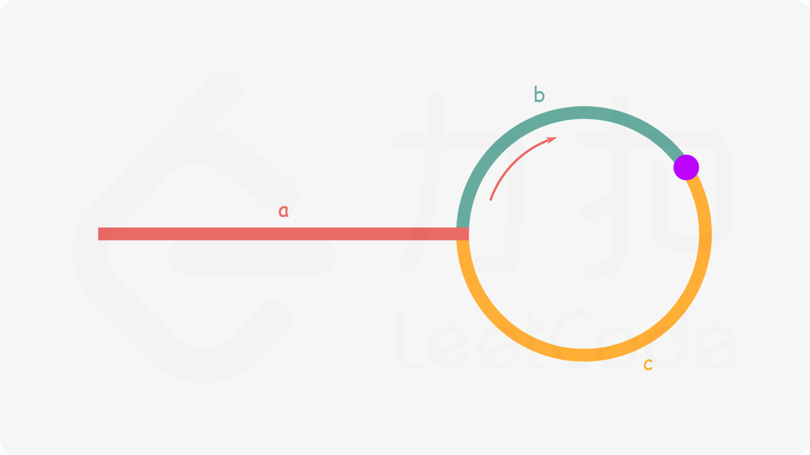
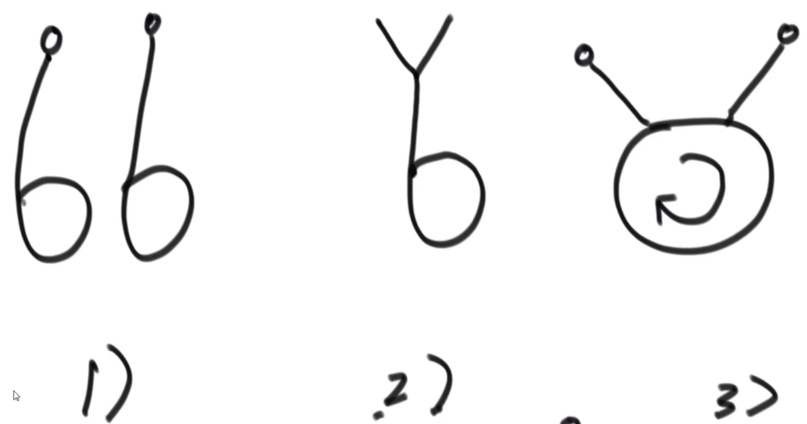

# 链表

以下为LeetCode默认的链表结构，每个节点存有一个值，和一个指向下一个节点的指针：

```c++
struct ListNode {
    int val;
    ListNode *next;
    ListNode(int x) : val(x), next(nullptr) {}
};
```

不同于数组，链表并不能直接获取任意节点的值，必须要通过指针找到该节点后才能获取其值。由于在进行链表操作时，尤其是删除节点时，经常会因为对当前节点进行操作而导致内存或指针出现问题。有两个小技巧可以解决这个问题：一是尽量**处理当前节点的下一个节点而非当前节点**本身，二是**建立一个虚拟节点 (dummy node)**，使其指向当前链表的头节点，这样即使原链表所有节点全被删除，也会有一个dummy 存在，返回 dummy->next 即可。

#### 1. 链表的基本操作：

包括遍历，反转(递归实现链表反转，题206)，反转链表中的某段区间，有序链表合并(21)等。 需要注意递归实现链表反转的[代码实现](https://leetcode-cn.com/problems/UHnkqh/solution/jian-zhi-offer-ii-024-fan-zhuan-lian-bia-bl1x/)：


```c++
// 先反转后面的链表，再往前反转
ListNode* reverseList(ListNode* head) {
    if(head == nullptr || head->next == nullptr) 
        return head;
    // 递归反转
    ListNode* newHead = reverseList(head->next);
    head->next->next = head;
    head->next = nullptr;
    return newHead;
}
// 非递归写法核心:
nextP = nowP->next;
nowP->next = preP;
preP = nowP;
nowP = nextP;
```

#### 2. 双指针：

涉及到双指针操作链表，包括快慢指针(141,**142**)，**相交链表**(160 链表交换)，回文链表(234 快慢指针+反转)，打印有序链表公共部分。

> 也可以使用额外的数据结构进行记录（哈希表等）

其中最有代表意义的就是判断一个链表是否有环（并得到环的入口）：使用快慢指针(快指针一次走2步，慢指针一次走1不)，如果有环快慢指针一定会在环上某个节点上相遇。为了得到入口，在快慢指针第一次相遇时，让快指针指向`head`，现在和慢指针每次走一步，第二次相遇的地点就是环的入口处。



其次，是两个链表是否相交（如果相交得到相交结点）：首先调用上一个算法，得到链表1的入环节点`loop1`，链表2的入环节点`loop2`（无环时为`nullptr`）

① 两个链表都是无环链表：双指针`p1,p2`分别走两条链表，当一条链表走完时，转移到另一条链表上。如果相交，`p1==p2`时一定在相交节点处；否则在`nullptr`处相交。

> 还有一种解法：`p1`遍历完链表1，记录结尾结点`end1`，长度`len1`；`p2`遍历完链表2，记录末尾结点`end2`，长度`len2`。首先判断`end1 == end2 ?`，如果相等证明有环，现在让长链表先走`abs(len1-len2)`步，然后同时移动，相交处即为第一个节点。

② 一个链表是有环链表，一个链表是无环链表：不成立！这种情况不可能相交。

③  两个链表都有环，又有三种情况，如下所示：



* 如果`loop1 == loop2`，那么属于情况2)，那么将入环节点作为末尾结点（终止节点），在使用①的代码即可；
* 如果`loop1 != loop2`，先让`loop1`走一圈，如果在这个过程中不能遇到`loop2`，那么属于情况1)，无交点；如果能够遇到`loop2`，那么属于情况3)，返回`loop1`或者`loop2`都可以。

#### 3. 链表排序

在机试当中，可以用额外的数组把链表存储下来，把它当做普通的排序题来做。但是在面试中，不能使用额外的空间。

对于排序链表，最自然想到的就是归并排序，核心代码段如下：

```c++
	// 合并两个有序链表
    ListNode* MergeList(ListNode* a, ListNode *b){
        ListNode * nullHead = new ListNode(-1);
        ListNode * p = nullHead;
        while (a && b) {
            if (a->val < b->val) {
                p->next = a;
                a = a->next;
            }
            else {
                p->next = b;
                b = b->next;
            }
            p = p->next;
        }
        if (a)   p->next = a;
        if (b)   p->next = b;
        return nullHead->next;
    }

    ListNode* MergeSort(ListNode* head){
        if (head == nullptr || head->next == nullptr)    return head;
        // 利用双指针找到中间节点
        ListNode * slowP = head, * fastP = head;
        while (fastP->next && fastP->next->next) {
            fastP = fastP->next->next;
            slowP = slowP->next;
        }
        // 将链表分成两半，分辨转换为有序链表
        ListNode * a = head, * b = slowP->next;
        slowP->next = nullptr;
        a = MergeSort(a);
        b = MergeSort(b);
        // 合并两个有序链表
        head = MergeList(a, b);
        return head;
    }

```

使用链表解决荷兰国旗问题：

```c++
ListNode* parition(ListNode* head, int target) {
    // 六个指针，指向大于、等于、小于target的区域
    ListNode * sH, * sT, * eH, * eT, * bH, * bT;
    sH = sT = eH = eT = bH = bT = nullptr;
    ListNode * p = head;
    // 将每个元素分配到对应的区域中
    while (p) {
        // 要特别注意，每次都需要将单个节点解开来分析，否则容易出现环路
        ListNode* next = p->next;
        p->next = nullptr;
        if (p->val < target) {
            if (sH == nullptr)  sH = sT = p;
            else {
                sT->next = p;
                sT = sT->next;
            }
        }
        else if (p->val == target) {
            if (eH == nullptr)  eH = eT = p;
            else {
                eT->next = p;
                eT = eT->next;
            }
        }
        else {
            if (bH == nullptr)  bH = bT = p;
            else {
                bT->next = p;
                bT = bT->next;
            }
        }
        p = next;
    }
    // 连接小于、等于区域
    if (sT != nullptr) {
        sT->next = eH;
        eT = eT == nullptr ? sT : eT;
    }
    // 连接等于、大于区域
    if (eT != nullptr) {
        eT->next = bH;
    }
    return sH != nullptr ? sH : (eH != nullptr ? eH : bH);
}
```

#### 4. 复杂链表的克隆

见题(剑指offer35：复杂链表的复制)，三步走：① 构造复制节点链接在原结点末尾；② 复制random指针；③ 分离链表。
