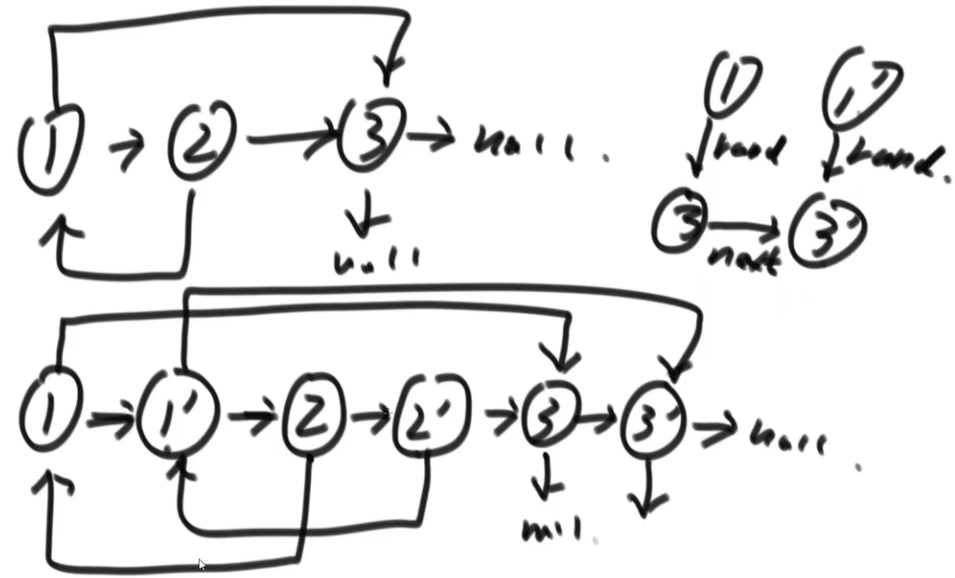

# 剑指offer35：复杂链表的复制

## 题目

请实现 copyRandomList 函数，复制一个复杂链表。在复杂链表中，每个节点除了有一个 next 指针指向下一个节点，还有一个 random 指针指向链表中的任意节点或者 null。

示例 1：


```
输入：head = [[7,null],[13,0],[11,4],[10,2],[1,0]]
输出：[[7,null],[13,0],[11,4],[10,2],[1,0]]
```

示例 2：

```
输入：head = [[1,1],[2,1]]
输出：[[1,1],[2,1]]
```

示例 3：

```
输入：head = [[3,null],[3,0],[3,null]]
输出：[[3,null],[3,0],[3,null]]
```

示例 4：

```
输入：head = []
输出：[]
解释：给定的链表为空（空指针），因此返回 null。
```


提示：

```
-10000 <= Node.val <= 10000
Node.random 为空（null）或指向链表中的节点。
节点数目不超过 1000 。
```

## 解法一：利用哈希表

利用哈希表存储**源节点**与**复制节点**之间的对应关系，具体来说：首先遍历一遍源节点，构造新节点，并将对应关系记录在哈希表中。在第二次遍历时，复制节点对应的next和random的指向位置都可以通过哈希表进行对应查找。代码如下：

```c++
class Solution {
public:
    Node* copyRandomList(Node* head) {
        unordered_map<Node*, Node*> nodeMap;
        Node* p = head;
        while (p) {	// 第一次遍历
            nodeMap[p] = new Node(p->val);
            p = p->next;
        }
        p = head;
        while (p) {	// 第二次遍历
            nodeMap[p]->next = p->next == nullptr ? nullptr : nodeMap[p->next];
            nodeMap[p]->random = p->random == nullptr ? nullptr : nodeMap[p->random];
            p = p->next;
        }
        return head == nullptr ? nullptr : nodeMap[head];
    }
};
```

时间复杂度：O(n)

空间复杂度：O(n)

## 解法二：节省哈希表



① 遍历原链中，将每个节点对应的克隆节点放在其next段；② 新链表，通过原链表的random去更新克隆链表的random指针；③ 遍历一次，将原链表和新链表进行解耦（同时维持next的一致性）。代码如下：

```c++
class Solution {
public:
    Node* copyRandomList(Node* head) {
        if (head == nullptr)    return nullptr;
        // 1. 复制链表结点,链接在原结点后
        Node* cur = head, * next;
        while (cur) {
            next = cur->next;
            cur->next = new Node(cur->val);
            cur->next->next = next;
            cur = next;
        }
        // 2. 拷贝random指针
        cur = head;
        while (cur) {
            next = cur->next->next;
            Node * copy = cur->next;
            copy->random = cur->random == nullptr ? nullptr : cur->random->next;
            cur = next;
        }
        // 3. 解耦原链表与复制链表
        cur = head;
        Node * res = cur->next;
        while (cur) {
            next = cur->next->next;
            Node * copy = cur->next;
            copy->next = next == nullptr ? nullptr : next->next;
            cur->next = next;
            cur = next;
        }
        return res;
    }
};
```

